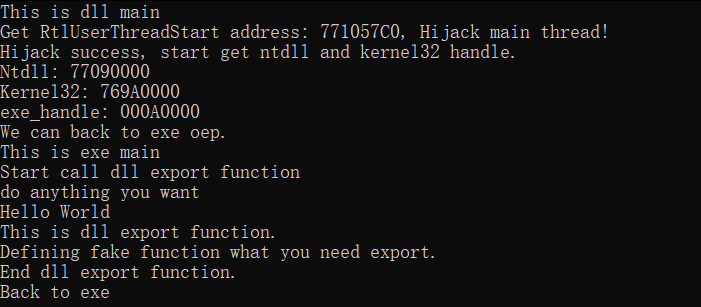

# NTR loader
Loader Pre-Technology, Main thread hijacking without using API, get ntdll and kernel32 handle without peb.  
加载器前置技术，不使用API进行主线程劫持，不使用PEB获取ntdll和kernel32的地址。  

This method is an improvement and extension of [NativeThreadRobber](https://github.com/miunasu/NativeThreadRobber).  
该技术是[NativeThreadRobber](https://github.com/miunasu/NativeThreadRobber)的改进和扩展。

eg: use to black dll.  
eg: 用于黑dll。 
# What this project can do
Are you tired of the sandbox?  
你是否厌烦了沙箱?  
Are you afraid that the method to get the handle through the PEB is already marked?    
你是否害怕通过PEB获取句柄的方法已被标记?  

After testing, whether it is a cloud sandbox or an edr sandbox, use rundll or loadlibrary with getprocess to start black dll, all of them fail to run properly and produce dynamic results.  
theory: [NativeThreadRobber](https://github.com/miunasu/NativeThreadRobber).     
经过测试，不管是云沙箱还是edr本地沙箱，使用rundll或者loadlibrary配合getprocess来启动黑dll，全都无法正常运行并跑出动态结果。  
原理: [NativeThreadRobber](https://github.com/miunasu/NativeThreadRobber)  

Get the handles of ntdll and kernel32 through the process of main thread hijacking.  
通过主线程劫持的过程获取ntdll和kernel32的句柄。 

No API will be used at all to achieve the above purpose!  
不使用任何API达到以上效果！

# Other
This Pre-Technology can achieve good anti anti-virus effect in combination with other technologies。After writing a simple loader for testing, it can avoid killing by most anti-virus software.  

该前置技术配合其他免杀技术可以达成良好的免杀效果，经过编写简易加载器测试，免杀大部分国外杀软，通杀国内杀软，包括XXX天擎edr、xx智甲edr等。

This project is just to share new and interesting simple techniques I found, so I won’t write about the matching technology in detail.   
Recommended matching technology:
>Gate Series  
>Stack Spoof  
>RDI  
>Unhook  
>Anti local Sandbox  
>SigFlip  
>Obfuscate  
>Encode  
>......  

该项目仅分享我新发现的有趣的简单技术，所以就不详细编写其他配合的技术。  
推荐配合使用的技术：
>门系列  
>栈欺骗  
>反射式注入  
>反hook  
>反杀软本地沙箱  
>SigFlip  
>混淆  
>加密  
>......

# Support
It's support x64 and x86 both.  
If you have any question, please open an issue on GitHub.

